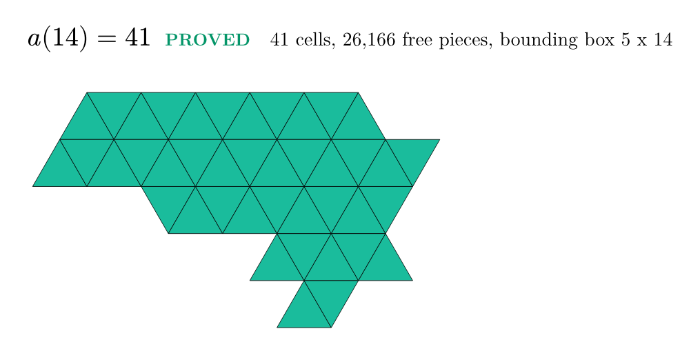

# OEIS (pending A-number) -- Smallest Polyiamond Containing All Free n-Iamonds

Solver code, data, and figures for the smallest connected polyiamond that contains every free polyiamond of size n as a sub-pattern.

## The Problem

a(n) = the minimum number of cells in a connected polyiamond such that every free n-iamond can be placed (translated, rotated, reflected) entirely within it. A polyiamond is a connected figure of edge-joined equilateral triangles. Each cell has exactly 3 edge-neighbors. Free n-iamonds are the [A000577](https://oeis.org/A000577)(n) distinct shapes up to translation, rotation, and reflection. This is the triangular-grid analog of [A327094](https://oeis.org/A327094) (square grid, Dawson's Minimum Common Superform problem for pentominoes, 1942).

## Results

**Proved terms (this work):**

| n | 1 | 2 | 3 | 4 | 5 | 6 | 7 | 8 | 9 | 10 | 11 | 12 | 13 | 14 |
|:---:|:---:|:---:|:---:|:---:|:---:|:---:|:---:|:---:|:---:|:---:|:---:|:---:|:---:|:---:|
| a(n) | 1 | 2 | 3 | 5 | 6 | 9 | 12 | 16 | 19 | 23 | 27 | 31 | 36 | 41 |
| free n-iamonds | 1 | 1 | 1 | 3 | 4 | 12 | 24 | 66 | 160 | 448 | 1186 | 3334 | 9235 | 26166 |

All 14 terms proved by SAT solver (Glucose 4.2 via PySAT) with CEGAR connectivity cuts. Each a(n) confirmed by SAT at k cells, UNSAT at k-1. Every reported value independently re-verified by brute-force enumeration (each free n-iamond tested against every orientation and offset inside the reported container). Terms n=10..14 additionally cross-validated on a larger grid (rows+1): same answers.



## Grid Family Comparison

| n | Triangle (this) | Square ([A327094](https://oeis.org/A327094)) |
|:---:|:---:|:---:|
| 4 | 5 | 6 |
| 5 | 6 | 9 |
| 6 | 9 | 12 |
| 7 | 12 | 17 |
| 8 | 16 | 20 |

Triangle values are smaller than square values for n >= 4. Triangular cells have 3 edge-neighbors (vs 4 for squares), making polyiamond pieces more linear and easier to pack into a common container.

## Method

Boolean satisfiability (SAT) solver (Glucose 4.2 via PySAT) with counterexample-guided abstraction refinement (CEGAR) for connectivity. For each n, free n-iamonds are enumerated and verified against [A000577](https://oeis.org/A000577). The SAT encoding has cell-occupancy variables plus per-placement auxiliaries (at least one placement per piece; each placement implies its cells are occupied). Cardinality is enforced with the totalizer encoding (exactly k cells) and shape constraints (contiguous columns per row plus at least one full row of width n) are applied for n >= 6. Connectivity is enforced lazily: solve, find components, cut disconnected solutions. Top-down search proves optimality: satisfiable (SAT) at k confirms a solution exists, unsatisfiable (UNSAT) at k-1 proves no smaller solution is possible.

**Key optimisation:** tight rectangular grid `rows = max(4, (n+2)//3)` by `n` columns, derived from observed solution bounding boxes at n=4..14. This single architectural choice gives a 457x speed-up at n=11 (7s vs 55 minutes with the initial n x n grid).

## Running the Solver

**Requirements:** Python 3.8+, python-sat

```bash
pip install python-sat

# Run all terms (n=1..14)
python code/solve_polyiamond_container.py --n 1-14

# Run specific term
python code/solve_polyiamond_container.py --n 12

# Run range
python code/solve_polyiamond_container.py --n 10-14
```

## Files

| File | Description |
|------|-------------|
| `code/solve_polyiamond_container.py` | SAT + CEGAR solver (main solver) |
| `code/generate-figures.py` | Publication figure generator (Typst) |
| `research/solver-results.json` | Machine-readable results with solutions |
| `research/solver-run-log.txt` | Reviewer-grade proof of solver run |
| `submission/hero-a14.png` | Optimal 41-cell container for n=14 |

## Prior Art and Acknowledgments

This is a new sequence -- no prior OEIS entry exists for the triangular-grid version. Prior-art search: 21 queries across OEIS (10), arXiv, Google Scholar, GitHub, and general web sources for "minimum common superform", "polyiamond universal container", and related terms. The problem generalises T. R. Dawson's 1942 Minimum Common Superform question for pentominoes (Fairy Chess Review Vol. 5 No. 4) to the triangular grid.

Related: [A327094](https://oeis.org/A327094) (square grid analog), [A000577](https://oeis.org/A000577) (free polyiamond count, the input to this problem), [A352029](https://oeis.org/A352029) (minimalist polyomino containers, count of square-grid minimum solutions).

This work was inspired by the [OEIS](https://oeis.org/) and the community of contributors who maintain it.

## Hardware

AMD Ryzen 5 5600 (6-core / 12-thread), 16 GB RAM.

## License

[CC-BY-4.0](https://creativecommons.org/licenses/by/4.0/) -- Peter Exley, 2026.

This work is freely available. If you find it useful, a citation or acknowledgment is appreciated but not required.

## Links

- **A000577** (number of free polyiamonds with n cells): https://oeis.org/A000577
- **A327094** (square-grid analog: smallest polyomino containing all free n-ominoes): https://oeis.org/A327094
- **A352029** (count of minimum-size square-grid containers): https://oeis.org/A352029
